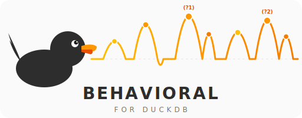

<p align="center">
  
</p>

<p align="center">
  <strong>Behavioral analytics functions for DuckDB, inspired by ClickHouse.</strong>
</p>

<p align="center">
  <a href="https://github.com/tomtom215/duckdb-behavioral/actions/workflows/ci.yml"></a>
  <a href="https://github.com/tomtom215/duckdb-behavioral/actions/workflows/e2e.yml"></a>
  <a href="https://crates.io/crates/duckdb-behavioral"></a>
  <a href="LICENSE"></a>
  <a href="https://www.rust-lang.org"></a>
  <a href="https://tomtom215.github.io/duckdb-behavioral/"></a>
</p>

<p align="center">
  <a href="#quick-start">Quick Start</a> &bull;
  <a href="#functions">Functions</a> &bull;
  <a href="#examples">Examples</a> &bull;
  <a href="#performance">Performance</a> &bull;
  <a href="https://tomtom215.github.io/duckdb-behavioral/">Documentation</a>
</p>

---

Provides `sessionize`, `retention`, `window_funnel`, `sequence_match`,
`sequence_count`, `sequence_match_events`, and `sequence_next_node` as a loadable
[DuckDB](https://duckdb.org/) extension written in Rust. **Complete
[ClickHouse](https://clickhouse.com/docs/en/sql-reference/aggregate-functions/parametric-functions)
behavioral analytics parity.**

> **Personal Project Disclaimer**: This is a personal project developed on my own
> time. It is not affiliated with, endorsed by, or related to my employer or
> professional role in any way.

> **AI-Assisted Development**: Built with Claude (Anthropic). Correctness is
> validated by automated testing — not assumed from AI output. See [Quality](#quality).

## Table of Contents

- [Quick Start](#quick-start)
- [Functions](#functions)
- [Examples](#examples)
- [Integrations](#integrations)
- [Performance](#performance)
- [Community Extension](#community-extension)
- [Quality](#quality)
- [ClickHouse Parity Status](#clickhouse-parity-status)
- [Building](#building)
- [Development](#development)
- [Documentation](#documentation)
- [Requirements](#requirements)
- [License](#license)

## Quick Start

```sql
-- Install from the DuckDB Community Extensions repository
INSTALL behavioral FROM community;
LOAD behavioral;
```

Or build from source:

```bash
cargo build --release
duckdb -unsigned -cmd "LOAD 'target/release/libbehavioral.so';"
```

**Verify it works** — run these one-liners after loading:

```sql
-- Session IDs (should return 1)
SELECT sessionize(TIMESTAMP '2024-01-01 10:00:00', INTERVAL '30 minutes') OVER () as session_id;

-- Retention (should return [true, false])
SELECT retention(true, false);

-- Funnel progress (should return 2)
SELECT window_funnel(INTERVAL '1 hour', TIMESTAMP '2024-01-01', true, true, false);
```

## Functions

| Function | Signature | Returns | Description |
|---|---|---|---|
| `sessionize` | `(TIMESTAMP, INTERVAL)` | `BIGINT` | Window function assigning session IDs based on inactivity gaps |
| `retention` | `(BOOLEAN, BOOLEAN, ...)` | `BOOLEAN[]` | Cohort retention analysis |
| `window_funnel` | `(INTERVAL [, VARCHAR], TIMESTAMP, BOOLEAN, ...)` | `INTEGER` | Conversion funnel step tracking with [6 combinable modes](https://tomtom215.github.io/duckdb-behavioral/functions/window-funnel.html) |
| `sequence_match` | `(VARCHAR, TIMESTAMP, BOOLEAN, ...)` | `BOOLEAN` | NFA-based [pattern matching](https://tomtom215.github.io/duckdb-behavioral/functions/sequence-match.html) over event sequences |
| `sequence_count` | `(VARCHAR, TIMESTAMP, BOOLEAN, ...)` | `BIGINT` | Count non-overlapping pattern matches |
| `sequence_match_events` | `(VARCHAR, TIMESTAMP, BOOLEAN, ...)` | `LIST(TIMESTAMP)` | Return matched condition timestamps |
| `sequence_next_node` | `(VARCHAR, VARCHAR, TIMESTAMP, VARCHAR, BOOLEAN, ...)` | `VARCHAR` | Next event value after pattern match |

All functions support **2 to 32 boolean conditions**, matching ClickHouse's limit.
Detailed documentation, examples, and edge case behavior for each function:
[Function Reference](https://tomtom215.github.io/duckdb-behavioral/functions/sessionize.html)

### Choosing the Right Function

| I want to... | Use |
|---|---|
| Break events into sessions by inactivity gap | `sessionize` |
| Check if users returned in later time periods | `retention` |
| Measure how far users get through ordered steps | `window_funnel` |
| Detect whether a pattern of events occurred | `sequence_match` |
| Count how many times a pattern occurred | `sequence_count` |
| Get timestamps of each matched pattern step | `sequence_match_events` |
| Find what happened immediately after/before a pattern | `sequence_next_node` |

## Examples

### Conversion Funnel

Track how far users progress through a purchase flow within 1 hour:

```sql
SELECT user_id,
  window_funnel(INTERVAL '1 hour', event_time,
    event_type = 'page_view',
    event_type = 'add_to_cart',
    event_type = 'checkout',
    event_type = 'purchase'
  ) as furthest_step
FROM events
GROUP BY user_id;
```

### Session Analysis

Assign session IDs with a 30-minute inactivity gap, then compute metrics:

```sql
WITH sessionized AS (
    SELECT user_id, event_time,
      sessionize(event_time, INTERVAL '30 minutes') OVER (
        PARTITION BY user_id ORDER BY event_time
      ) as session_id
    FROM events
)
SELECT user_id, session_id,
  COUNT(*) as page_views,
  MIN(event_time) as session_start,
  MAX(event_time) as session_end
FROM sessionized
GROUP BY user_id, session_id;
```

### Weekly Retention

Measure week-over-week retention for signup cohorts:

```sql
SELECT cohort_week,
  COUNT(*) as cohort_size,
  SUM(CASE WHEN r[1] THEN 1 ELSE 0 END) as week_0,
  SUM(CASE WHEN r[2] THEN 1 ELSE 0 END) as week_1,
  SUM(CASE WHEN r[3] THEN 1 ELSE 0 END) as week_2
FROM (
  SELECT user_id, cohort_week,
    retention(
      activity_date >= cohort_week AND activity_date < cohort_week + INTERVAL '7 days',
      activity_date >= cohort_week + INTERVAL '7 days' AND activity_date < cohort_week + INTERVAL '14 days',
      activity_date >= cohort_week + INTERVAL '14 days' AND activity_date < cohort_week + INTERVAL '21 days'
    ) as r
  FROM activity GROUP BY user_id, cohort_week
)
GROUP BY cohort_week ORDER BY cohort_week;
```

### Pattern Detection with Time Constraints

Find users who viewed then purchased within 1 hour:

```sql
SELECT user_id,
  sequence_match('(?1).*(?t<=3600)(?2)', event_time,
    event_type = 'page_view',
    event_type = 'purchase'
  ) as converted_within_hour
FROM events GROUP BY user_id;
```

### Funnel Drop-off Report

Aggregate funnel results into a conversion report:

```sql
WITH funnels AS (
  SELECT user_id,
    window_funnel(INTERVAL '1 hour', event_time,
      event_type = 'page_view', event_type = 'add_to_cart',
      event_type = 'checkout', event_type = 'purchase'
    ) as step
  FROM events GROUP BY user_id
)
SELECT step as reached_step,
  COUNT(*) as users,
  ROUND(100.0 * COUNT(*) / SUM(COUNT(*)) OVER (), 1) as pct
FROM funnels GROUP BY step ORDER BY step;
```

### User Flow Analysis

Discover what page users visit after Home → Product:

```sql
SELECT
  sequence_next_node('forward', 'first_match', event_time, page,
    page = 'Home', page = 'Home', page = 'Product'
  ) as next_page,
  COUNT(*) as user_count
FROM events GROUP BY ALL ORDER BY user_count DESC;
```

### Pattern Frequency

Count how many times users repeat a view → cart cycle:

```sql
SELECT user_id,
  sequence_count('(?1).*(?2)', event_time,
    event_type = 'page_view',
    event_type = 'add_to_cart'
  ) as view_cart_cycles
FROM events GROUP BY user_id ORDER BY view_cart_cycles DESC;
```

### Matched Event Timestamps

Get the exact timestamps when each funnel step was satisfied:

```sql
SELECT user_id,
  sequence_match_events('(?1).*(?2).*(?3)', event_time,
    event_type = 'page_view',
    event_type = 'add_to_cart',
    event_type = 'purchase'
  ) as step_timestamps
FROM events GROUP BY user_id;
```

For 5 complete real-world examples with sample data, see
[Use Cases](https://tomtom215.github.io/duckdb-behavioral/use-cases.html).
For a comprehensive recipe collection, see
[SQL Cookbook](https://tomtom215.github.io/duckdb-behavioral/cookbook.html).

## Integrations

### Python

```python
import duckdb

conn = duckdb.connect()
conn.execute("INSTALL behavioral FROM community")
conn.execute("LOAD behavioral")

df = conn.execute("""
    SELECT user_id,
      window_funnel(INTERVAL '1 hour', event_time,
        event_type = 'view', event_type = 'cart', event_type = 'purchase'
      ) as steps
    FROM events GROUP BY user_id
""").fetchdf()
```

### Node.js

```javascript
const duckdb = require('duckdb');
const db = new duckdb.Database(':memory:');

db.run("INSTALL behavioral FROM community");
db.run("LOAD behavioral");
```

### dbt

```yaml
# profiles.yml
my_project:
  outputs:
    dev:
      type: duckdb
      extensions:
        - name: behavioral
          repo: community
```

### Parquet / CSV / JSON

```sql
-- Query any file format directly
SELECT user_id,
  window_funnel(INTERVAL '1 hour', event_time,
    event_type = 'view', event_type = 'purchase')
FROM read_parquet('events/*.parquet')
GROUP BY user_id;
```

## Performance

All measurements below are Criterion.rs 0.8.2 with 95% confidence intervals,
validated across multiple runs on commodity hardware.

| Function | Scale | Wall Clock | Throughput |
|---|---|---|---|
| `sessionize` | **1 billion** | **1.20 s** | **830 Melem/s** |
| `retention` (combine) | 100 million | 274 ms | 365 Melem/s |
| `window_funnel` | 100 million | 791 ms | 126 Melem/s |
| `sequence_match` | 100 million | 1.05 s | 95 Melem/s |
| `sequence_count` | 100 million | 1.18 s | 85 Melem/s |
| `sequence_match_events` | 100 million | 1.07 s | 93 Melem/s |
| `sequence_next_node` | 10 million | 546 ms | 18 Melem/s |

**Key design choices:**

- **16-byte `Copy` events** with `u32` bitmask conditions — four events per cache
  line, zero heap allocation per event
- **O(1) combine** for `sessionize` and `retention` via boundary tracking and
  bitmask OR
- **In-place combine** for event-collecting functions — O(N) amortized instead
  of O(N^2) from repeated allocation
- **NFA fast paths** — common pattern shapes dispatch to specialized O(n) linear
  scans instead of full NFA backtracking
- **Presorted detection** — O(n) check skips O(n log n) sort when events arrive
  in timestamp order

**Optimization highlights:**

| Optimization | Speedup | Technique |
|---|---|---|
| Event bitmask | 5–13x | `Vec<bool>` replaced with `u32` bitmask, enabling `Copy` semantics |
| In-place combine | up to 2,436x | O(N) amortized extend instead of O(N^2) merge-allocate |
| NFA lazy matching | 1,961x at 1M events | Swapped exploration order so `.*` tries advancing before consuming |
| `Arc<str>` values | 2.1–5.8x | Reference-counted strings for O(1) clone in `sequence_next_node` |
| NFA fast paths | 39–61% | Pattern classification dispatches common shapes to O(n) linear scans |

Five attempted optimizations were measured, found to be regressions, and reverted.
All negative results are documented in [`PERF.md`](PERF.md).

Full methodology, per-session optimization history with confidence intervals, and
reproducible benchmark instructions: [`PERF.md`](PERF.md).

## Community Extension

This extension is listed in the
[DuckDB Community Extensions](https://github.com/duckdb/community-extensions)
repository ([PR #1306](https://github.com/duckdb/community-extensions/pull/1306),
merged 2026-02-15). Install with:

```sql
INSTALL behavioral FROM community;
LOAD behavioral;
```

No build tools, compilation, or `-unsigned` flag required.

### Update Process

The [`community-submission.yml`](.github/workflows/community-submission.yml)
workflow automates the full pre-submission pipeline in 5 phases:

| Phase | Purpose |
|-------|---------|
| Validate | `description.yml` schema, version consistency, required files |
| Quality Gate | `cargo test`, `clippy`, `fmt`, `doc` |
| Build & Test | `make configure && make release && make test_release` |
| Pin Ref | Updates `description.yml` ref to the validated commit SHA |
| Submission Package | Uploads artifact, generates step-by-step PR commands |

### Updating the Published Extension

Push changes to this repository, re-run the submission workflow to pin the new
ref, then open a new PR against `duckdb/community-extensions` updating the ref
field in `extensions/behavioral/description.yml`. When DuckDB releases a new
version, update `libduckdb-sys`, `TARGET_DUCKDB_VERSION`, and the
`extension-ci-tools` submodule.

## Quality

| Metric | Value |
|---|---|
| Unit tests | 453 + 1 doc-test |
| E2E tests | 27 (against real DuckDB CLI) |
| Property-based tests | 26 (proptest) |
| Mutation testing | 88.4% kill rate (130/147, cargo-mutants) |
| Clippy warnings | 0 (pedantic + nursery + cargo lint groups) |
| CI jobs | 13 (check, test, clippy, fmt, doc, MSRV, bench, deny, semver, coverage, cross-platform, extension-build) |
| Benchmark files | 7 (Criterion.rs, up to 1 billion elements) |
| Release platforms | 4 (Linux x86_64/ARM64, macOS x86_64/ARM64) |

CI runs on every push and PR: 6 workflows across `.github/workflows/` including
E2E tests against real DuckDB, CodeQL static analysis, SemVer validation, and
4-platform release builds with provenance attestation.

## ClickHouse Parity Status

**COMPLETE** — All ClickHouse behavioral analytics functions are implemented.

| Function | Status |
|---|---|
| `retention` | Complete |
| `window_funnel` (6 modes) | Complete |
| `sequence_match` | Complete |
| `sequence_count` | Complete |
| `sequence_match_events` | Complete |
| `sequence_next_node` | Complete |
| 32-condition support | Complete |
| `sessionize` | Extension-only (no ClickHouse equivalent) |

## Building

**Prerequisites**: Rust 1.84.1+ (MSRV), a C compiler (for DuckDB sys bindings)

```bash
# Build the extension (release mode)
cargo build --release

# The loadable extension will be at:
# target/release/libbehavioral.so   (Linux)
# target/release/libbehavioral.dylib (macOS)
```

## Development

```bash
cargo test                  # Unit tests + doc-tests (453 + 1)
cargo clippy --all-targets  # Zero warnings required
cargo fmt -- --check        # Format check
cargo bench                 # Criterion.rs benchmarks
cargo doc --no-deps         # Build API documentation

# Run all quality checks at once
./scripts/check.sh

# Build extension via community Makefile
git submodule update --init
make configure && make release && make test_release
```

This project follows [Semantic Versioning](https://semver.org/).
See the [versioning policy](https://tomtom215.github.io/duckdb-behavioral/operations/security.html#versioning)
for the full SemVer rules applied to SQL function signatures.

## Documentation

- **[Getting Started](https://tomtom215.github.io/duckdb-behavioral/getting-started.html)** — installation, loading, troubleshooting
- **[Function Reference](https://tomtom215.github.io/duckdb-behavioral/functions/sessionize.html)** — detailed docs for all 7 functions
- **[Use Cases](https://tomtom215.github.io/duckdb-behavioral/use-cases.html)** — 5 complete real-world examples with sample data
- **[SQL Cookbook](https://tomtom215.github.io/duckdb-behavioral/cookbook.html)** — practical recipes for common analytics patterns
- **[Quick Reference](https://tomtom215.github.io/duckdb-behavioral/quick-reference.html)** — one-page cheat sheet for all functions and patterns
- **[Engineering Overview](https://tomtom215.github.io/duckdb-behavioral/engineering.html)** — architecture, testing philosophy, design trade-offs
- **[Performance](https://tomtom215.github.io/duckdb-behavioral/internals/performance.html)** — benchmarks, optimization history, methodology
- **[ClickHouse Compatibility](https://tomtom215.github.io/duckdb-behavioral/internals/clickhouse-compatibility.html)** — syntax mapping, semantic parity
- **[Contributing](https://tomtom215.github.io/duckdb-behavioral/contributing.html)** — development setup, testing, PR process

## Requirements

- Rust 1.84.1+ (MSRV)
- DuckDB 1.5.1 (pinned dependency)
- Python 3.x (for extension metadata tooling)

## License

MIT
