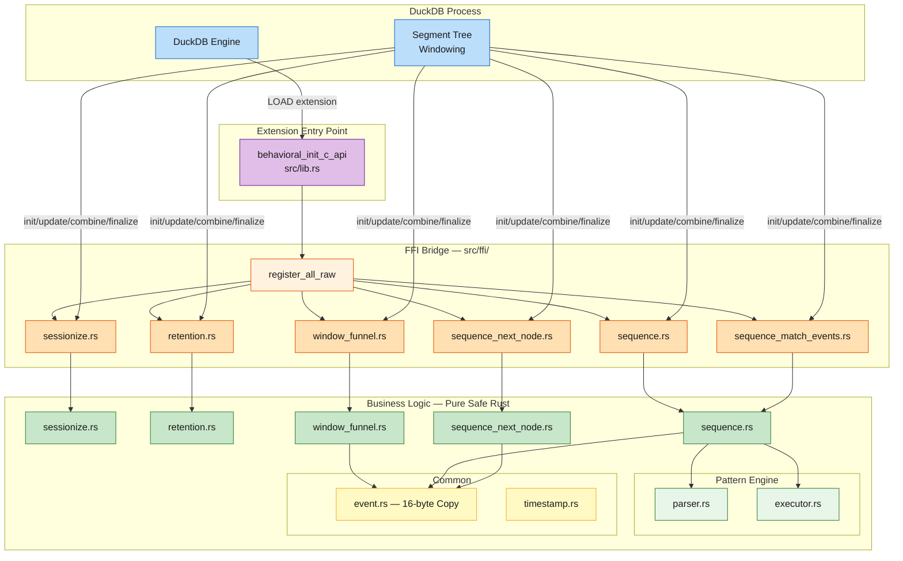
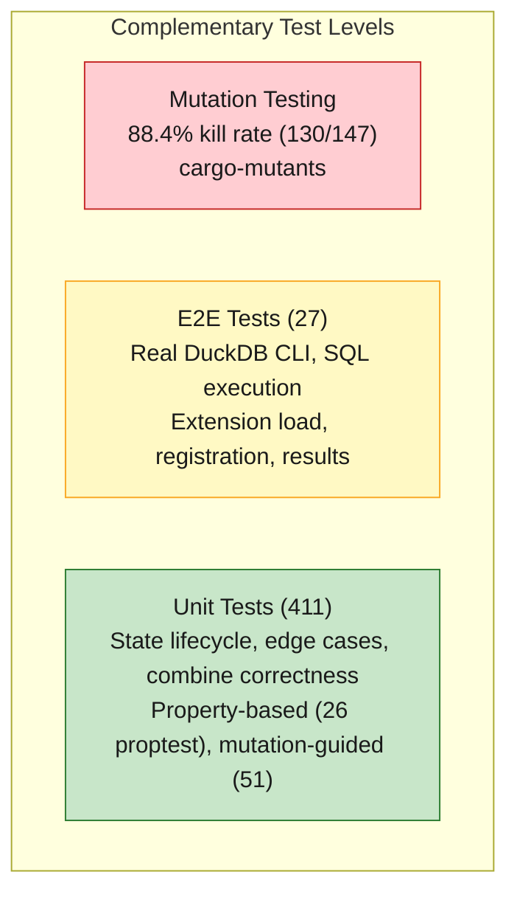
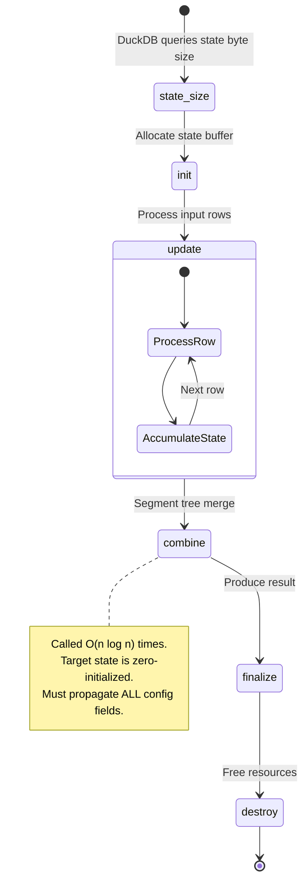
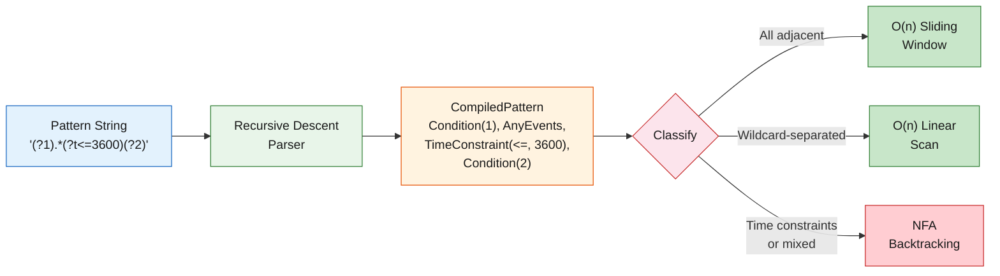

# Engineering Overview

This page provides a technical summary of the engineering decisions, quality
standards, and design trade-offs that underpin `duckdb-behavioral`. It is
intended for technical evaluators, contributors, and anyone seeking to
understand the depth and rigor of this project.

---

## Project Scope

`duckdb-behavioral` is a loadable extension for [DuckDB](https://duckdb.org/)
that implements the complete set of behavioral analytics functions found in
[ClickHouse](https://clickhouse.com/). The extension is written entirely in
Rust, compiles to a shared library (`.so` / `.dylib`), and integrates with
DuckDB via the C extension API.

The project spans several distinct engineering disciplines:

| Discipline | Scope |
|---|---|
| **Systems programming** | Rust FFI, raw C API callbacks, memory-safe aggregate state management, `unsafe` code confinement |
| **Database internals** | DuckDB's segment tree windowing, aggregate function lifecycle (init, update, combine, finalize, destroy), data chunk format |
| **Algorithm design** | NFA-based pattern matching, recursive descent parsing, greedy funnel search, bitmask-based retention analysis |
| **Performance engineering** | Cache-aware data structures, algorithmic complexity analysis, Criterion.rs benchmarking with confidence intervals, negative result documentation |
| **Software quality** | 411 unit tests, 27 E2E tests, property-based testing (proptest), mutation testing (cargo-mutants, 88.4% kill rate), zero clippy warnings under pedantic lints |
| **CI/CD and release engineering** | Multi-platform builds (Linux x86/ARM, macOS x86/ARM), SemVer validation, artifact attestation, reproducible builds |
| **Technical writing** | mdBook documentation site, function reference pages, optimization history with measured data, ClickHouse compatibility matrix |

---

## Architecture

### Separation of Concerns

The codebase enforces a strict separation between business logic and FFI
integration:



- **Business logic** (`src/*.rs`, `src/common/`, `src/pattern/`): Pure safe
  Rust. No FFI types, no `unsafe` blocks. All algorithmic work -- pattern
  parsing, NFA execution, funnel search, retention bitmask logic -- lives here.
  This layer is independently testable via `cargo test` with no DuckDB
  dependency.

- **FFI bridge** (`src/ffi/`): Contains all `unsafe` code. Each function has a
  dedicated FFI module implementing the five DuckDB aggregate callbacks
  (`state_size`, `init`, `update`, `combine`, `finalize`). Every `unsafe` block
  has a `// SAFETY:` comment documenting the invariants it relies on.

- **Entry point** (`src/lib.rs`): A custom C entry point
  (`behavioral_init_c_api`) that bypasses the `duckdb` Rust crate's connection
  wrapper entirely, using `duckdb_connect` directly from the extension access
  struct. This eliminates struct layout fragility across DuckDB versions.

### Why This Matters

This architecture enables:

- **Independent unit testing**: Business logic tests run in < 1 second with no
  DuckDB instance. All 411 tests exercise Rust structs directly.
- **Safe evolution**: Updating the DuckDB version only requires updating
  `libduckdb-sys` in `Cargo.toml` and re-running E2E tests. Business logic
  is decoupled from the database.
- **Auditable unsafe scope**: The `unsafe` boundary is confined to `src/ffi/`
  (6 files). Reviewers can audit the safety-critical code without reading the
  entire codebase.

---

## Testing Philosophy

### The Test Pyramid



This project implements a rigorous multi-level testing strategy:

**Level 1: Unit Tests (411 tests)**

Organized by category within each module:

- **State lifecycle tests** -- empty state, single update, multiple updates,
  finalize
- **Edge cases** -- threshold boundaries, NULL handling, empty inputs, overflow
  at type boundaries (`u32::MAX`, `i64::MIN`)
- **Combine correctness** -- empty-into-empty, empty-into-populated,
  populated-into-empty, associativity verification, configuration propagation
- **Property-based tests (26 proptest)** -- algebraic properties required by
  DuckDB's segment tree: combine associativity, commutativity, identity element,
  idempotency, monotonicity
- **Mutation-testing-guided tests (51)** -- tests written specifically to kill
  mutants that survived initial test suites

**Level 2: E2E Tests (27 tests)**

Integration tests against a real DuckDB CLI instance that validate the complete
chain: extension loading, function registration, SQL execution, and result
correctness. These tests caught three critical bugs that all 411 unit tests
missed:

1. A segmentation fault on extension load (incorrect pointer arithmetic)
2. Six of seven functions silently failing to register (missing API call)
3. `window_funnel` returning incorrect results (combine not propagating
   configuration)

**Level 3: Mutation Testing (88.4% kill rate)**

`cargo-mutants` systematically replaces operators, removes branches, and
changes return values across the codebase. Of 147 generated mutants, 130
were caught by the test suite. The 17 survivors are documented and represent
code paths where mutations produce semantically equivalent behavior (e.g.,
OR vs XOR on non-overlapping bitmasks).

### Key Insight

Unit tests validate algorithmic correctness in isolation. E2E tests validate
the integration boundary. Neither alone is sufficient. The three bugs found
in E2E testing (Session 10) were entirely in the FFI layer -- a domain that
unit tests by definition cannot exercise.

---

## Performance Engineering

### Methodology

Every performance claim in this project is backed by:

- **Criterion.rs benchmarks** with 95% confidence intervals
- **Multiple runs** (minimum 3) to establish baselines
- **Throughput reporting** (elements per second) alongside wall clock time
- **Negative results documented honestly** -- five attempted optimizations
  were measured, found to be regressions, reverted, and documented

### Scale

| Function Class | Max Benchmark Scale | Constraint |
|---|---|---|
| O(1) state (sessionize, retention) | **1 billion elements** | Compute-bound; no per-event memory |
| Event-collecting (window_funnel, sequence_*) | **100 million elements** | 1.6 GB working set at 16 bytes/event |
| String-carrying (sequence_next_node) | **10 million elements** | 32 bytes/event with `Arc<str>` allocation |

### Optimization History

Fourteen sessions of measured optimization, each following a documented protocol:

1. Establish baseline with 3 Criterion runs
2. Implement one optimization per commit
3. Measure before/after with confidence intervals
4. Accept only when confidence intervals do not overlap
5. Revert and document if the improvement is not statistically significant

Selected highlights:

| Optimization | Improvement | Scale |
|---|---|---|
| Event bitmask (Vec\<bool\> to u32) | 5--13x | All event functions |
| In-place combine (O(N^2) to O(N)) | Up to **2,436x** | Combine operations at 10K states |
| NFA lazy matching (greedy to lazy) | **1,961x** | sequence_match at 1M events |
| Arc\<str\> (String to reference counted) | 2.1--5.8x | sequence_next_node |
| NFA fast paths (linear scan) | 39--61% | sequence_count |

Five attempted optimizations were negative results:

- **LSD radix sort**: 4.3x slower than pdqsort for 16-byte embedded-key structs
- **Branchless sessionize**: 5--10% regression; branch predictor handles 90/10
  patterns efficiently
- **String pool with index vectors**: 10--55% slower than Arc\<str\> at most scales
- **Compiled pattern preservation**: Caching parsed patterns did not improve performance
- **First-condition pre-check**: Adding an early-exit branch for non-matching first conditions increased overhead

Full optimization history with confidence intervals: [Performance](./internals/performance.md)

---

## Domain Significance

### Why Behavioral Analytics Matters

Behavioral analytics answers a class of questions that traditional SQL
aggregations cannot express efficiently:

- **Sessionization**: Given a stream of timestamped events, partition them
  into logical sessions based on inactivity gaps. This is fundamental to web
  analytics, mobile app analysis, and IoT telemetry.

- **Retention cohorts**: Given users who first appeared at time T, what
  fraction returned at T+1, T+2, T+N? This is the core metric for SaaS
  businesses, subscription services, and any product measuring long-term
  engagement.

- **Conversion funnels**: Given a multi-step process (browse, add to cart,
  checkout, purchase), how far does each user progress within a time window?
  This directly drives revenue optimization in e-commerce.

- **Event sequence patterns**: Given a temporal sequence of heterogeneous
  events, does a specific pattern occur? How many times? What happened next?
  This generalizes to fraud detection, clinical event monitoring, user journey
  analysis, and process mining.

### Who Needs This

| Audience | Application |
|---|---|
| **Product analytics teams** | Funnel analysis, retention metrics, session analysis, user journey mapping |
| **Data engineers** | Replacing external analytics services (Amplitude, Mixpanel) with in-database SQL |
| **Security analysts** | Detecting temporal attack patterns in log data |
| **Clinical researchers** | Analyzing sequential treatment events in patient data |
| **DevOps/SRE** | Sessionizing log streams, identifying incident escalation patterns |
| **Academic researchers** | Process mining, sequential pattern mining on large datasets |

### Scale Context

These problems are inherently large-scale. A mid-sized SaaS application
generates millions of events per day. An e-commerce platform during a sale
event can produce hundreds of millions of events per hour. The ability to
process one billion sessionize events in 1.20 seconds on a single core means
these analyses can run as interactive queries rather than batch jobs.

---

## Implementation Challenges

### DuckDB Aggregate Function Registration

DuckDB's Rust crate does not provide high-level aggregate function
registration. This project uses the raw C API (`libduckdb-sys`) directly,
implementing five callback functions per aggregate:



```
state_size  -- Returns the byte size of the aggregate state
init        -- Initializes a new state (called by DuckDB's segment tree)
update      -- Processes one row of input into the state
combine     -- Merges two states (called O(n log n) times by segment tree)
finalize    -- Produces the final result from the accumulated state
```

Because `duckdb_aggregate_function_set_varargs` does not exist, each function
that accepts a variable number of boolean conditions (retention, window_funnel,
sequence_match, sequence_count, sequence_match_events, sequence_next_node)
must register **31 overloads** (2--32 parameters) via a function set.

### NFA Pattern Engine

The sequence functions use a custom NFA (Nondeterministic Finite Automaton)
pattern engine:



- A **recursive descent parser** that compiles pattern strings (e.g.,
  `(?1).*(?t<=3600)(?2)`) into an intermediate representation of typed steps
- An **NFA executor** that evaluates the pattern against a sorted event stream
  using lazy backtracking with optional time constraints
- **Fast-path classifiers** that detect common pattern shapes (adjacent
  conditions, wildcard-separated conditions) and dispatch to specialized O(n)
  linear scans, avoiding the full NFA for the majority of real-world patterns

### Combine Semantics in DuckDB's Segment Tree

DuckDB's windowing and grouping machinery uses a segment tree that creates
fresh zero-initialized states and combines source states into them. This
creates a subtle correctness requirement: `combine` must propagate **all**
configuration fields (window size, mode flags, pattern string, direction/base
parameters), not just the accumulated data. Missing this caused silent
incorrect results that passed all unit tests but failed E2E validation.

---

## Quality Standards

| Metric | Value |
|---|---|
| Unit tests | 411 |
| Doc-tests | 1 |
| E2E tests | 27 |
| Property-based tests | 26 (proptest) |
| Mutation-guided tests | 51 |
| Mutation kill rate | 88.4% (130/147) |
| Clippy warnings | 0 (pedantic + nursery + cargo) |
| Unsafe block count | Confined to `src/ffi/` (6 files) |
| MSRV | Rust 1.80 |
| Criterion benchmark files | 7 |
| Max benchmark scale | 1 billion elements |
| CI jobs | 13 (check, test, clippy, fmt, doc, MSRV, bench, deny, semver, coverage, cross-platform, extension-build) |
| Documented negative results | 5 (radix sort, branchless, string pool, compiled pattern, first-condition pre-check) |
| ClickHouse parity | Complete (7/7 functions, all modes, 32 conditions) |

---

## Technology Stack

| Layer | Technology | Purpose |
|---|---|---|
| Language | Rust (stable, MSRV 1.80) | Memory safety, zero-cost abstractions, `unsafe` confinement |
| Database | DuckDB 1.4.4 | Analytical SQL engine, segment tree windowing |
| FFI | libduckdb-sys (C API) | Raw aggregate function registration |
| Benchmarking | Criterion.rs | Statistical benchmarking with confidence intervals |
| Property testing | proptest | Algebraic property verification |
| Mutation testing | cargo-mutants | Test suite effectiveness measurement |
| Documentation | mdBook | Static site generation for GitHub Pages |
| CI/CD | GitHub Actions | Multi-platform build, test, release, attestation |
| Dependency audit | cargo-deny | License compliance, advisory database checks |
| SemVer validation | cargo-semver-checks | API compatibility verification |
