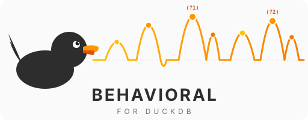
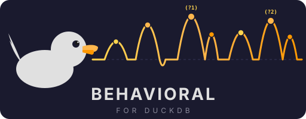
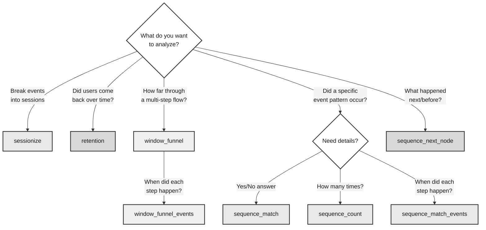

<p align="center">
  
  
</p>

<div class="badges">
<a href="https://github.com/tomtom215/duckdb-behavioral/actions/workflows/ci.yml"></a>
<a href="https://github.com/tomtom215/duckdb-behavioral/actions/workflows/e2e.yml"></a>
<a href="https://github.com/tomtom215/duckdb-behavioral/blob/main/LICENSE"></a>
<a href="https://www.rust-lang.org"></a>
</div>

# duckdb-behavioral

**Behavioral analytics for DuckDB -- session analysis, conversion funnels,
retention cohorts, and event sequence pattern matching, all inside your SQL
queries.**

`duckdb-behavioral` is a loadable DuckDB extension written in Rust that brings
[ClickHouse-style behavioral analytics functions](https://clickhouse.com/docs/en/sql-reference/aggregate-functions/parametric-functions)
to DuckDB. It ships eight battle-tested functions that cover the core patterns
of user behavior analysis — all six ClickHouse behavioral functions with
source-verified semantics, plus two extensions — and benchmark-validated
performance at billion-row scale.

No external services, no data pipelines, no additional infrastructure. Load the
extension, write SQL, get answers.

---

## What Can You Do With This?

### Session Analysis

Break a continuous stream of events into logical sessions based on inactivity
gaps. Identify how many sessions a user has per day, how long each session lasts,
and where sessions begin and end.

```sql
SELECT user_id, event_time,
  sessionize(event_time, INTERVAL '30 minutes') OVER (
    PARTITION BY user_id ORDER BY event_time
  ) as session_id
FROM events;
```

### Conversion Funnels

Track how far users progress through a multi-step conversion funnel (page view,
add to cart, checkout, purchase) within a time window. Identify exactly where
users drop off.

```sql
SELECT user_id,
  window_funnel(INTERVAL '1 hour', event_time,
    event_type = 'page_view',
    event_type = 'add_to_cart',
    event_type = 'checkout',
    event_type = 'purchase'
  ) as furthest_step
FROM events
GROUP BY user_id;
```

### Retention Cohorts

Measure whether users who appeared in a cohort (e.g., signed up in January)
returned in subsequent periods. Build the classic retention triangle directly in
SQL.

```sql
SELECT cohort_month,
  retention(
    activity_date = cohort_month,
    activity_date = cohort_month + INTERVAL '1 month',
    activity_date = cohort_month + INTERVAL '2 months',
    activity_date = cohort_month + INTERVAL '3 months'
  ) as retained
FROM user_activity
GROUP BY user_id, cohort_month;
```

### Event Sequence Pattern Matching

Detect complex behavioral patterns using a mini-regex over event conditions.
Find users who viewed a product, then purchased within one hour -- with any
number of intervening events.

```sql
SELECT user_id,
  sequence_match('(?1).*(?t<=3600)(?2)', event_time,
    event_type = 'view',
    event_type = 'purchase'
  ) as converted_within_hour
FROM events
GROUP BY user_id;
```

### User Journey / Flow Analysis

Discover what users do *after* a specific behavioral sequence. What page do
users visit after navigating from Home to Product? The inner query computes one
next page per user; the outer query counts users per page (without the inner
`GROUP BY user_id`, all users' events would form one sequence).

```sql
SELECT next_page, COUNT(*) AS user_count
FROM (
  SELECT user_id,
    sequence_next_node('forward', 'first_match', event_time, page,
      page = 'Home', page = 'Home', page = 'Product') AS next_page
  FROM events
  GROUP BY user_id
)
GROUP BY next_page
ORDER BY user_count DESC;
```

---

## Quick Installation

### Community Extension

The extension is listed in the
[DuckDB Community Extensions](https://github.com/duckdb/community-extensions)
repository:

```sql
INSTALL behavioral FROM community;
LOAD behavioral;
```

No build tools, compilation, or `-unsigned` flag required.

### From Source

```bash
git clone --recurse-submodules https://github.com/tomtom215/duckdb-behavioral.git
cd duckdb-behavioral
make configure release   # cargo build --release + metadata footer
```

This produces `build/release/behavioral.duckdb_extension`. DuckDB only loads
files ending in `.duckdb_extension`, so the raw `target/release/libbehavioral.so`
(or `.dylib`) cannot be loaded directly. Locally built extensions are unsigned,
so start DuckDB with `-unsigned`:

```bash
duckdb -unsigned -c "LOAD 'build/release/behavioral.duckdb_extension'; SELECT behavioral_version();"
```

For detailed installation instructions, troubleshooting, and a complete
worked example, see the [Getting Started](./getting-started.md) guide.

---

## Functions

### Choosing the Right Function



Eight aggregate functions plus one diagnostic scalar:

| Function | Type | Returns | Description |
|---|---|---|---|
| [`sessionize`](./functions/sessionize.md) | Aggregate (used with `OVER (ORDER BY ...)`) | `BIGINT` | Assigns session IDs based on inactivity gaps |
| [`retention`](./functions/retention.md) | Aggregate | `BOOLEAN[]` | Cohort retention analysis |
| [`window_funnel`](./functions/window-funnel.md) | Aggregate | `INTEGER` | Conversion funnel step tracking |
| [`window_funnel_events`](./functions/window-funnel-events.md) | Aggregate | `LIST(TIMESTAMP)` | Timestamps of the best funnel chain |
| [`sequence_match`](./functions/sequence-match.md) | Aggregate | `BOOLEAN` | Pattern matching over event sequences |
| [`sequence_count`](./functions/sequence-count.md) | Aggregate | `BIGINT` | Count non-overlapping pattern matches |
| [`sequence_match_events`](./functions/sequence-match-events.md) | Aggregate | `LIST(TIMESTAMP)` | Return matched condition timestamps |
| [`sequence_next_node`](./functions/sequence-next-node.md) | Aggregate | `VARCHAR` | Next event value after pattern match |
| `behavioral_version` | Scalar | `VARCHAR` | Version of the loaded extension |

Condition limits: `window_funnel` and `window_funnel_events` accept 1 to 32
conditions; `retention`, `sequence_match`, `sequence_count`, and
`sequence_match_events` accept 2 to 32; `sequence_next_node` accepts a base
condition plus 1 to 32 event conditions (ClickHouse allows up to 64 for
`sequenceNextNode`). See the [ClickHouse Compatibility](./internals/clickhouse-compatibility.md)
page for the full parity matrix.

---

## Performance

The numbers below are
[Criterion.rs](https://bheisler.github.io/criterion.rs/book/) microbenchmarks
of the Rust aggregate state (update/combine/finalize), not end-to-end SQL
queries, with 95% confidence intervals. They are the PERF.md Session 15
headline numbers, recorded before v0.8.0 and not re-measured since.

| Function | Scale | Wall Clock | Throughput |
|---|---|---|---|
| **`sessionize_update`** | **1 billion events** | **1.20 s** | **830 Melem/s** |
| **`retention_combine`** | **100 million states** | **274 ms** | **365 Melem/s** |
| `window_funnel_finalize` | 100 million events | 791 ms | 126 Melem/s |
| `sequence_match` | 100 million events | 1.05 s | 95 Melem/s |
| `sequence_count` | 100 million events | 1.18 s | 85 Melem/s |
| `sequence_match_events` | 100 million events | 1.07 s | 93 Melem/s |
| `sequence_next_node` | 10 million events | 546 ms | 18 Melem/s |

Key design choices that enable this performance:

- **16-byte `Copy` events** with `u32` bitmask conditions -- four events per
  cache line, zero heap allocation per event
- **O(1) combine** for `sessionize` and `retention` via boundary tracking and
  bitmask OR
- **In-place combine** for event-collecting functions -- O(N) amortized instead
  of O(N^2) from repeated allocation
- **Sequence fast paths** -- common pattern shapes dispatch to specialized O(n)
  linear scans; every other pattern uses a feasibility pass plus a greedy walk,
  O(s · n log n), replacing a backtracking search that was quadratic per group
- **Presorted detection** -- O(n) check skips O(n log n) sort when events
  already arrive in timestamp order

Full methodology, per-element cost analysis, and optimization history are
documented in the [Performance](./internals/performance.md) section.

---

## Engineering Highlights

This project demonstrates depth across systems programming, database internals,
algorithm design, performance engineering, and software quality practices.
For a comprehensive technical overview, see the
[Engineering Overview](./engineering.md).

| Area | Highlights |
|---|---|
| **Language & Safety** | Pure Rust core with `unsafe` confined to the FFI bridge (`src/ffi/`, 9 files). Aggregate callbacks wrapped by quack-rs `aggregate_*_callback!` macros, which turn a panic into a SQL error. Zero clippy warnings under pedantic, nursery, and cargo lint groups. |
| **Testing Rigor** | 545 unit tests, 28 in-process integration tests that `LOAD` the built extension, 78 sqllogictest directives (44 `query` + 34 `statement`) across 8 SQL test files run against the DuckDB CLI, 31 property-based tests (proptest), 88.4% mutation kill rate (cargo-mutants, measured on v0.4.x and not re-measured since). |
| **Performance** | Optimization sessions recorded in [PERF.md](https://github.com/tomtom215/duckdb-behavioral/blob/main/PERF.md) with before/after Criterion.rs measurements and 95% confidence intervals, including a 1-billion-event `sessionize_update` benchmark and five documented negative results. |
| **Algorithm Design** | Custom pattern engine with recursive descent parser, fast-path classification, and a feasibility-then-greedy matcher differentially tested against a backtracking reference. Bitmask-based retention with O(1) combine. |
| **Database Internals** | DuckDB C API integration via [quack-rs](https://crates.io/crates/quack-rs) SDK with safe builders, state management, and vector I/O. Variadic signatures registered as function sets (31 overloads for `retention` and the `sequence_match`/`sequence_count`/`sequence_match_events` family, 64 for `window_funnel`/`window_funnel_events`, 32 for `sequence_next_node`). Stable C API (v1.2.0): one binary loads into DuckDB 1.3.2 through 1.5.6. Correct combine semantics for segment tree windowing. |
| **CI/CD** | 14 CI jobs (incl. a DuckDB-WASM compile check), 4-platform release builds, SemVer validation, artifact attestation, MSRV verification. |
| **Feature Completeness** | All six ClickHouse behavioral functions (source-verified semantics) plus `sessionize` and `window_funnel_events`: 6 combinable funnel modes, 32-condition support, time-constrained pattern syntax. |

---

## Documentation

| Section | Contents |
|---|---|
| [Getting Started](./getting-started.md) | Installation, loading, troubleshooting, your first analysis |
| [Function Reference](./functions/sessionize.md) | Detailed docs for all 8 functions with examples |
| [Use Cases](./use-cases.md) | Five complete real-world examples with sample data and queries |
| [SQL Cookbook](./cookbook.md) | 25+ practical SQL recipes for common analytics patterns |
| [Quick Reference](./quick-reference.md) | One-page cheat sheet for all functions and patterns |
| [FAQ](./faq.md) | Common questions about loading, patterns, modes, NULLs |
| [Engineering Overview](./engineering.md) | Technical depth, architecture, quality standards, domain significance |
| [Architecture](./internals/architecture.md) | Module structure, design decisions, FFI bridge |
| [Performance](./internals/performance.md) | Benchmarks, algorithmic complexity, optimization history |
| [ClickHouse Compatibility](./internals/clickhouse-compatibility.md) | Syntax mapping, semantic parity matrix |
| [Operations](./operations/ci-cd.md) | CI/CD, security and supply chain, benchmarking methodology |
| [Contributing](./contributing.md) | Development setup, testing expectations, PR process |

---

## Requirements

- **DuckDB 1.3.2 or later** (built against 1.5.6; stable C API, so one binary serves every release CI checks: 1.3.2, 1.4.4, 1.5.0, 1.5.6)
- **Rust 1.87+** (MSRV) for building from source
- Python 3 and `make` for `make configure release` (stamps the metadata footer)

## Source Code

The source code is available at
[github.com/tomtom215/duckdb-behavioral](https://github.com/tomtom215/duckdb-behavioral).

## License

MIT
