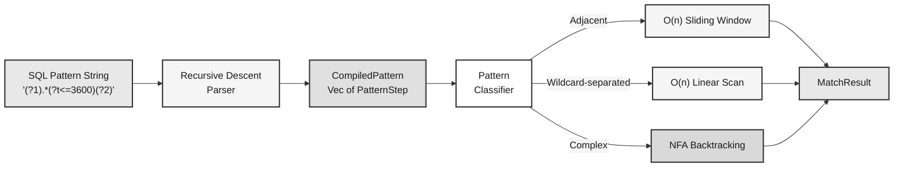
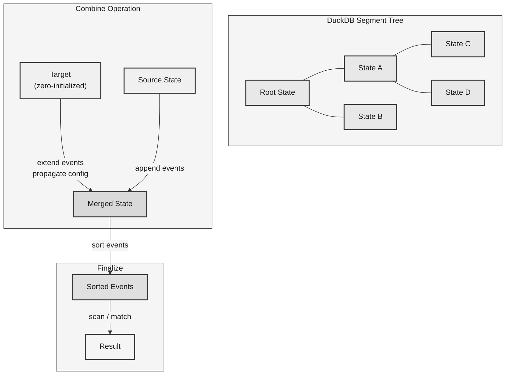

# Architecture

This page describes the internal architecture of the `duckdb-behavioral` extension,
including the module structure, design decisions, and the FFI bridge between Rust
business logic and DuckDB's C API.

## Module Structure

```
src/
  lib.rs                       Entry point via quack_rs::entry_point! macro
  common/
    mod.rs
    event.rs                   Event type (u32 bitmask, Copy, 16 bytes)
    timestamp.rs               Interval-to-microseconds conversion
  pattern/
    mod.rs
    parser.rs                  Recursive descent parser for pattern strings
    executor.rs                NFA-based pattern matcher with fast paths
  sessionize.rs                Session boundary tracking (O(1) combine)
  retention.rs                 Bitmask-based cohort retention (O(1) combine)
  window_funnel.rs             Greedy forward scan with combinable mode bitflags
  sequence.rs                  Sequence match/count/events state management
  sequence_next_node.rs        Next event value after pattern match (Arc<str>)
  ffi/
    mod.rs                     register_all_raw() dispatcher
    sessionize.rs              FFI callbacks (raw libduckdb-sys — window function)
    retention.rs               FFI via quack-rs FfiState + VectorReader
    window_funnel.rs           FFI via quack-rs builder + FfiState + VectorReader
    sequence.rs                FFI via quack-rs builder for sequence_match/count
    sequence_match_events.rs   FFI via quack-rs FfiState (raw registration for LIST)
    sequence_next_node.rs      FFI via quack-rs builder + VectorReader::read_str
```

## Design Principles

### Pure Rust Core with FFI Bridge

All business logic lives in the top-level modules (`sessionize.rs`, `retention.rs`,
`window_funnel.rs`, `sequence.rs`, `sequence_next_node.rs`, `pattern/`) with zero
FFI dependencies. These modules are fully testable in isolation using standard
Rust unit tests.

The `ffi/` submodules handle DuckDB C API registration exclusively. This
separation ensures that:

- Business logic can be tested without a DuckDB instance.
- The unsafe FFI boundary is confined to a single directory.
- Every `unsafe` block has a `// SAFETY:` comment documenting its invariants.

### Aggregate Function Lifecycle

DuckDB requires five callbacks for aggregate function registration:

| Callback | Purpose |
|---|---|
| `state_size` | Returns the byte size of the aggregate state |
| `state_init` | Initializes a new state (heap-allocates the Rust struct) |
| `state_update` | Processes input rows, updating the state |
| `state_combine` | Merges two states (used by DuckDB's segment tree) |
| `state_finalize` | Produces the output value from a state |

Each FFI module uses `quack_rs::aggregate::FfiState<T>` for safe state
management. `FfiState<T>` handles heap allocation, null-checked access via
`with_state_mut()`, and memory reclamation — replacing hand-rolled
`Box::from_raw` patterns.

### Function Sets for Variadic Signatures

DuckDB does not provide a `duckdb_aggregate_function_set_varargs` API. To support
variable numbers of boolean condition parameters (2 to 32), each function is
registered as a **function set** containing 31 overloads, one for each arity.

This is necessary for `retention`, `window_funnel`, `sequence_match`,
`sequence_count`, `sequence_match_events`, and `sequence_next_node`. The
`sessionize` function has a fixed two-parameter signature and does not require a
function set.

### Entry Point via quack-rs

The extension uses the `quack_rs::entry_point!` macro to generate the
`behavioral_init_c_api` symbol. The macro handles API initialization,
connection management via `duckdb_connect`/`duckdb_disconnect`, and error
reporting — replacing ~80 lines of hand-rolled unsafe code from earlier
versions.

### quack-rs SDK

The FFI layer uses [quack-rs](https://github.com/tomtom215/quack-rs) v0.3.0,
a Rust SDK for DuckDB loadable extensions. It provides:

- **`AggregateFunctionSetBuilder`**: Safe registration of function sets with
  automatic per-overload naming (preventing the Session 10 bug where 6 of 7
  functions silently failed to register).
- **`FfiState<T>`**: Null-checked state management with `with_state_mut()`
  returning `Option<&mut T>`, safe init/destroy lifecycle.
- **`VectorReader`/`VectorWriter`**: Safe vector I/O replacing raw pointer
  arithmetic (`read_bool()`, `read_str()`, `read_interval()`, `write_i32()`,
  `set_null()`).
- **`AggregateTestHarness`**: Unit-test harness for verifying combine
  config-propagation without E2E testing.

Functions with parameterized return types (`LIST(BOOLEAN)`, `LIST(TIMESTAMP)`)
use raw `libduckdb-sys` for registration but quack-rs for state/vector ops.
`sessionize` remains fully hand-rolled (window function limitation in quack-rs).
The `duckdb` crate is used only in `#[cfg(test)]` for unit tests.

## Event Representation

The `Event` struct is shared across `window_funnel`, `sequence_match`,
`sequence_count`, and `sequence_match_events`:

```rust
#[derive(Debug, Clone, Copy, PartialEq, Eq)]
pub struct Event {
    pub timestamp_us: i64,   // 8 bytes
    pub conditions: u32,     // 4 bytes
    // 4 bytes padding (alignment to 8)
}                            // Total: 16 bytes
```

**Design choices:**

- **`u32` bitmask** instead of `Vec<bool>` eliminates per-event heap allocation
  and enables O(1) condition checks via bitwise AND. Supports up to 32 conditions,
  matching ClickHouse's limit.
- **`Copy` semantics** enable zero-cost event duplication in combine operations.
- **16 bytes** packs four events per 64-byte cache line, maximizing spatial
  locality during sorting and scanning.
- Expanding from `u8` (8 conditions) to `u32` (32 conditions) was a zero-cost
  change: the struct is 16 bytes in both cases due to alignment padding from the
  `i64` field.

## Pattern Engine

The pattern engine (`src/pattern/`) compiles pattern strings into a structured
AST and executes them via an NFA.



### Parser

The recursive descent parser (`parser.rs`) converts pattern strings like
`(?1).*(?t<=3600)(?2)` into a `CompiledPattern` containing a sequence of
`PatternStep` variants:

- `Condition(usize)` -- match an event where condition N is true
- `AnyEvents` -- match zero or more events (`.*`)
- `OneEvent` -- match exactly one event (`.`)
- `TimeConstraint(TimeOp, i64)` -- time constraint between steps

### NFA Executor

The executor (`executor.rs`) classifies patterns at execution time and dispatches
to specialized code paths:

- **Adjacent conditions** (`(?1)(?2)(?3)`): O(n) sliding window scan
- **Wildcard-separated** (`(?1).*(?2).*(?3)`): O(n) single-pass linear scan
- **Complex patterns**: Full NFA with backtracking

Three execution modes are supported:

| Mode | Function | Returns |
|---|---|---|
| `execute_pattern` | `sequence_match` / `sequence_count` | `MatchResult` (match + count) |
| `execute_pattern_events` | `sequence_match_events` | `Vec<i64>` (matched timestamps) |

The NFA uses **lazy matching** for `.*`: it prefers advancing the pattern over
consuming additional events. This is critical for performance -- greedy matching
causes O(n^2) behavior at scale because the NFA consumes all events before
backtracking to try advancing the pattern.

## Combine Strategy

DuckDB's segment tree windowing calls `combine` O(n log n) times. The combine
implementation is the dominant cost for event-collecting functions.



| Function | Combine Strategy | Complexity |
|---|---|---|
| `sessionize` | Compare boundary timestamps | O(1) |
| `retention` | Bitwise OR of bitmasks | O(1) |
| `window_funnel` | In-place event append | O(m) |
| `sequence_*` | In-place event append | O(m) |
| `sequence_next_node` | In-place event append | O(m) |

The in-place combine (`combine_in_place`) extends `self.events` directly instead
of allocating a new `Vec`. This reduces a left-fold chain from O(N^2) total
copies to O(N) amortized. Events are sorted once during finalize, not during
combine. This deferred sorting strategy avoids redundant work.

## Sorting

Events are sorted by timestamp using `sort_unstable_by_key` (pdqsort):

1. An O(n) presorted check (`Iterator::windows(2)`) detects already-sorted input
   and skips the sort entirely. This is the common case for `ORDER BY` queries.
2. For unsorted input, pdqsort provides O(n log n) worst-case with excellent
   cache locality for 16-byte `Copy` types.

Stable sort is not used because same-timestamp event order has no defined
semantics in ClickHouse's behavioral analytics functions.
