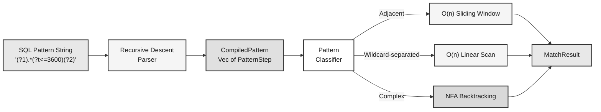
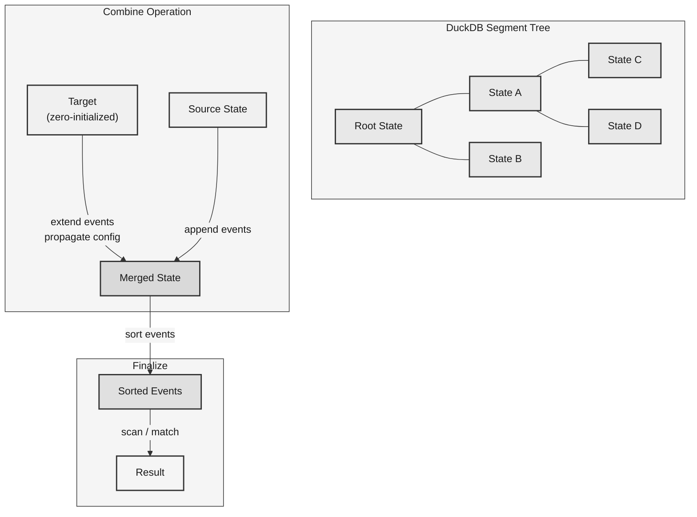

# Architecture

This page describes the internal architecture of the `duckdb-behavioral` extension,
including the module structure, design decisions, and the FFI bridge between Rust
business logic and DuckDB's C API.

## Module Structure

```
src/
  lib.rs                       Entry point via quack_rs::entry_point_v2! macro
  common/
    mod.rs
    event.rs                   Event type (u32 bitmask, Copy, 16 bytes)
    timestamp.rs               Interval-to-microseconds conversion
  pattern/
    mod.rs
    parser.rs                  Recursive descent parser for pattern strings
    executor.rs                NFA-based pattern matcher with fast paths
  sessionize.rs                Session boundary tracking (O(1) combine)
  retention.rs                 Bitmask-based cohort retention (O(1) combine)
  window_funnel.rs             Greedy forward scan with combinable mode bitflags
  sequence.rs                  Sequence match/count/events state management
  sequence_next_node.rs        Next event value after pattern match (Arc<str>)
  ffi/
    mod.rs                     register_all() dispatcher
    sessionize.rs              FFI via quack-rs AggregateFunctionBuilder (fixed signature)
    retention.rs               FFI via quack-rs builder + returns_logical(LIST(BOOLEAN)) + ListVector
    window_funnel.rs           FFI via quack-rs builder + FfiState + VectorReader/VectorWriter
    window_funnel_events.rs    FFI sharing window_funnel update/combine + LIST(TIMESTAMP) finalize
    sequence.rs                FFI via quack-rs builder for sequence_match/count
    sequence_match_events.rs   FFI via quack-rs builder + returns_logical(LIST(TIMESTAMP)) + ListVector
    sequence_next_node.rs      FFI via quack-rs builder + VectorWriter::write_varchar
    version.rs                 behavioral_version() scalar via quack-rs ScalarFunctionBuilder
```

## Design Principles

### Pure Rust Core with FFI Bridge

All business logic lives in the top-level modules (`sessionize.rs`, `retention.rs`,
`window_funnel.rs`, `sequence.rs`, `sequence_next_node.rs`, `pattern/`) with zero
FFI dependencies. These modules are fully testable in isolation using standard
Rust unit tests.

The `ffi/` submodules handle DuckDB C API registration exclusively. This
separation ensures that:

- Business logic can be tested without a DuckDB instance.
- The unsafe FFI boundary is confined to a single directory.
- Every callback's `unsafe` block has a `// SAFETY:` comment documenting its
  invariants.
- The update, combine, and finalize callbacks are generated by quack-rs's
  `aggregate_{update,combine,finalize}_callback!` macros, which turn a panic
  into a SQL error. The release profile sets `panic = "unwind"` so that this
  guard is effective.

### Aggregate Function Lifecycle

Each aggregate registers these callbacks (plus a destroy callback that frees
the Rust state):

| Callback | Purpose |
|---|---|
| `state_size` | Returns the byte size of the aggregate state |
| `state_init` | Initializes a new state (heap-allocates the Rust struct) |
| `state_update` | Processes input rows, updating the state |
| `state_combine` | Merges two states (used by DuckDB's segment tree) |
| `state_finalize` | Produces the output value from a state |

Each FFI module uses `quack_rs::aggregate::FfiState<T>` for safe state
management. `FfiState<T>` handles heap allocation, null-checked access via
`with_state_mut()`, and memory reclamation — replacing hand-rolled
`Box::from_raw` patterns.

### Function Sets for Variadic Signatures

DuckDB does not provide a `duckdb_aggregate_function_set_varargs` API. To support
variable numbers of boolean condition parameters, each variadic function is
registered as a **function set** with one overload per arity:

| Function | Conditions | Overloads |
|---|---|---|
| `retention`, `sequence_match`, `sequence_count`, `sequence_match_events` | 2 to 32 | 31 each |
| `window_funnel`, `window_funnel_events` | 1 to 32, with and without a mode `VARCHAR` | 64 each |
| `sequence_next_node` | base condition + 1 to 32 event conditions | 32 |

The `sessionize` function has a fixed two-parameter signature and does not
require a function set; neither does the `behavioral_version()` scalar.

### Entry Point via quack-rs

The extension uses the `quack_rs::entry_point_v2!` macro with the
`Connection`/`Registrar` trait pattern. Functions are registered via
`con.register_aggregate_set(builder)` (variadic aggregates),
`con.register_aggregate(builder)` (`sessionize`), and
`con.register_scalar(builder)` (`behavioral_version`). This replaces ~80 lines of
hand-rolled unsafe code from earlier versions.

### quack-rs SDK

The FFI layer uses [quack-rs](https://crates.io/crates/quack-rs) v0.18.0,
a Rust SDK for DuckDB loadable extensions. It provides:

- **`AggregateFunctionSetBuilder`**: Safe registration of function sets with
  automatic per-overload naming. Supports both `.returns(TypeId)` for simple types
  and `.returns_logical(LogicalType)` for parameterized types like `LIST(T)`.
- **`FfiState<T>`**: Null-checked state management with `with_state_mut()`
  returning `Option<&mut T>`, safe init/destroy lifecycle.
- **`VectorReader`**: Safe input reading (`read_bool()`, `read_str()`,
  `read_i64()`, `read_interval()`, `is_valid()`).
- **`VectorWriter`**: Safe output writing (`write_i32()`, `write_bool()`,
  `write_varchar()`, `set_null()` with automatic validity bitmap setup).
- **`ListVector`**: Safe LIST output (`reserve()`, `set_size()`, `set_entry()`,
  `child_writer()`) replacing raw `duckdb_list_vector_*` pointer arithmetic.
- **`LogicalType::list()`**: RAII construction of `LIST(T)` types for
  `returns_logical()`.
- **`aggregate_{update,combine,finalize}_callback!`**: Macros that generate
  the `extern "C"` callbacks with a panic guard, reporting a panic as a SQL
  error.
- **`AggregateTestHarness`**: Unit-test harness for verifying combine
  config-propagation without E2E testing.
- **`testing::InMemoryDb`** (dev-only `bundled-test-prebuilt` feature): used
  by `tests/extension_load.rs` to `LOAD` the built extension in-process.

All 8 aggregate functions use quack-rs builders for registration: the seven
variadic functions via `AggregateFunctionSetBuilder` (including `retention`,
`window_funnel_events`, and `sequence_match_events`, which use
`.returns_logical(LogicalType::list(...))` for their `LIST(T)` return types),
and `sessionize` via `AggregateFunctionBuilder` — DuckDB windows any
aggregate, so no window-specific registration exists.
The `duckdb` crate is declared as a dev-dependency (without the `bundled`
feature) so that test builds link a prebuilt libduckdb
(`DUCKDB_DOWNLOAD_LIB=1` or `DUCKDB_LIB_DIR`); no code in `src/`, `tests/`, or
`benches/` references it.

The extension uses only the stable C API. The `.duckdb_extension` file is
stamped with C API version `v1.2.0` and ABI type `C_STRUCT`, so one binary
loads into DuckDB 1.3.2 and later (CI checks 1.3.2, 1.4.4, 1.5.0, and 1.5.6).

## Event Representation

The `Event` struct is shared across `window_funnel`, `sequence_match`,
`sequence_count`, and `sequence_match_events`:

```rust
#[derive(Debug, Clone, Copy, PartialEq, Eq)]
pub struct Event {
    pub timestamp_us: i64,   // 8 bytes
    pub conditions: u32,     // 4 bytes
    // 4 bytes padding (alignment to 8)
}                            // Total: 16 bytes
```

**Design choices:**

- **`u32` bitmask** instead of `Vec<bool>` eliminates per-event heap allocation
  and enables O(1) condition checks via bitwise AND. Supports up to 32 conditions
  (ClickHouse's `windowFunnel` and `sequenceMatch` also allow 32; its
  `sequenceNextNode` allows 64).
- **`Copy` semantics** enable zero-cost event duplication in combine operations.
- **16 bytes** packs four events per 64-byte cache line, maximizing spatial
  locality during sorting and scanning.
- Expanding from `u8` (8 conditions) to `u32` (32 conditions) was a zero-cost
  change: the struct is 16 bytes in both cases due to alignment padding from the
  `i64` field.

## Pattern Engine

The pattern engine (`src/pattern/`) compiles pattern strings into a structured
AST and executes them via an NFA.


```mermaid
%%{init: {'theme': 'base', 'themeVariables': {'primaryColor': '#ffffff', 'primaryTextColor': '#1a1a1a', 'primaryBorderColor': '#333333', 'lineColor': '#333333', 'secondaryColor': '#f5f5f5', 'tertiaryColor': '#e0e0e0', 'textColor': '#1a1a1a'}}}%%
flowchart LR
    SQL["SQL Pattern String<br/>'(?1).*(?t<=3600)(?2)'"]
    PARSE["Recursive Descent<br/>Parser"]
    CP["CompiledPattern<br/>Vec of PatternStep"]
    CLASS["Pattern<br/>Classifier"]

    SQL --> PARSE --> CP --> CLASS

    CLASS -->|Adjacent| ADJ["O(n) Sliding Window"]
    CLASS -->|Wildcard-separated| WC["O(n) Linear Scan"]
    CLASS -->|Complex| NFA["NFA Backtracking"]

    ADJ --> RES["MatchResult"]
    WC --> RES
    NFA --> RES

    style SQL fill:#e8e8e8,stroke:#333333,stroke-width:2px,color:#1a1a1a
    style PARSE fill:#f5f5f5,stroke:#333333,stroke-width:2px,color:#1a1a1a
    style CP fill:#e0e0e0,stroke:#333333,stroke-width:2px,color:#1a1a1a
    style CLASS fill:#ffffff,stroke:#333333,stroke-width:2px,color:#1a1a1a
    style ADJ fill:#f5f5f5,stroke:#333333,stroke-width:2px,color:#1a1a1a
    style WC fill:#f5f5f5,stroke:#333333,stroke-width:2px,color:#1a1a1a
    style NFA fill:#d9d9d9,stroke:#333333,stroke-width:2px,color:#1a1a1a
    style RES fill:#e8e8e8,stroke:#333333,stroke-width:2px,color:#1a1a1a
```

### Parser

The recursive descent parser (`parser.rs`) converts pattern strings like
`(?1).*(?t<=3600)(?2)` into a `CompiledPattern` containing a sequence of
`PatternStep` variants:

- `Condition(usize)` -- match an event where condition N is true
- `AnyEvents` -- match zero or more events (`.*`)
- `OneEvent` -- match exactly one event (`.`)
- `TimeConstraint(TimeOp, i64)` -- time constraint between steps

### NFA Executor

The executor (`executor.rs`) classifies patterns at execution time and dispatches
to specialized code paths:

- **Adjacent conditions** (`(?1)(?2)(?3)`): O(n) sliding window scan
- **Wildcard-separated** (`(?1).*(?2).*(?3)`): O(n) single-pass linear scan
- **Complex patterns**: Full NFA with backtracking

Two entry points are provided:

| Mode | Function | Returns |
|---|---|---|
| `execute_pattern` | `sequence_match` / `sequence_count` | `MatchResult` (match + count) |
| `execute_pattern_events` | `sequence_match_events` | `Vec<i64>` (matched timestamps) |

The NFA uses **lazy matching** for `.*`: it prefers advancing the pattern over
consuming additional events. This is critical for performance -- greedy matching
causes O(n^2) behavior at scale because the NFA consumes all events before
backtracking to try advancing the pattern.

## Combine Strategy

DuckDB's segment tree windowing calls `combine` O(n log n) times. The combine
implementation is the dominant cost for event-collecting functions.


```mermaid
%%{init: {'theme': 'base', 'themeVariables': {'primaryColor': '#ffffff', 'primaryTextColor': '#1a1a1a', 'primaryBorderColor': '#333333', 'lineColor': '#333333', 'secondaryColor': '#f5f5f5', 'tertiaryColor': '#e0e0e0', 'textColor': '#1a1a1a', 'clusterBkg': '#f5f5f5', 'clusterBorder': '#333333'}}}%%
flowchart TB
    subgraph "DuckDB Segment Tree"
        R["Root State"]
        L1["State A"]
        L2["State B"]
        L3["State C"]
        L4["State D"]
        R --- L1 & L2
        L1 --- L3 & L4
    end

    subgraph "Combine Operation"
        T["Target<br/>(zero-initialized)"]
        S["Source State"]
        T -->|"extend events<br/>propagate config"| M["Merged State"]
        S -->|"append events"| M
    end

    subgraph "Finalize"
        M -->|"sort events"| SORT["Sorted Events"]
        SORT -->|"scan / match"| OUT["Result"]
    end

    style R fill:#e8e8e8,stroke:#333333,stroke-width:2px,color:#1a1a1a
    style L1 fill:#e8e8e8,stroke:#333333,stroke-width:2px,color:#1a1a1a
    style L2 fill:#e8e8e8,stroke:#333333,stroke-width:2px,color:#1a1a1a
    style L3 fill:#e8e8e8,stroke:#333333,stroke-width:2px,color:#1a1a1a
    style L4 fill:#e8e8e8,stroke:#333333,stroke-width:2px,color:#1a1a1a
    style T fill:#f0f0f0,stroke:#333333,stroke-width:2px,color:#1a1a1a
    style S fill:#f0f0f0,stroke:#333333,stroke-width:2px,color:#1a1a1a
    style M fill:#d9d9d9,stroke:#333333,stroke-width:2px,color:#1a1a1a
    style SORT fill:#e0e0e0,stroke:#333333,stroke-width:2px,color:#1a1a1a
    style OUT fill:#f5f5f5,stroke:#333333,stroke-width:2px,color:#1a1a1a
```

| Function | Combine Strategy | Complexity |
|---|---|---|
| `sessionize` | Compare boundary timestamps | O(1) |
| `retention` | Bitwise OR of bitmasks | O(1) |
| `window_funnel` | In-place event append | O(m) |
| `sequence_*` | In-place event append | O(m) |
| `sequence_next_node` | In-place event append | O(m) |

The in-place combine (`combine_in_place`) extends `self.events` directly instead
of allocating a new `Vec`. This reduces a left-fold chain from O(N^2) total
copies to O(N) amortized. Events are sorted once during finalize, not during
combine. This deferred sorting strategy avoids redundant work.

## Sorting

Events are sorted with an unstable sort (pdqsort) on a total key:

| State | Sort key |
|---|---|
| `Event` (`window_funnel`, `window_funnel_events`, `sequence_*`) | `(timestamp, conditions)` |
| `NextNodeEvent` (`sequence_next_node`) | `(timestamp, value, base_condition, conditions)` |

1. An O(n) presorted check (`windows(2)` over the same key) detects input that
   is already in key order and skips the sort entirely.
2. For unsorted input, pdqsort provides O(n log n) worst-case with good
   cache locality for 16-byte `Copy` types.

Ties on timestamp are broken by the remaining key fields, so the result is
deterministic regardless of the order in which DuckDB delivers rows or
combines partial states. A stable sort would not give that guarantee, because
arrival order itself varies with parallel aggregation.
